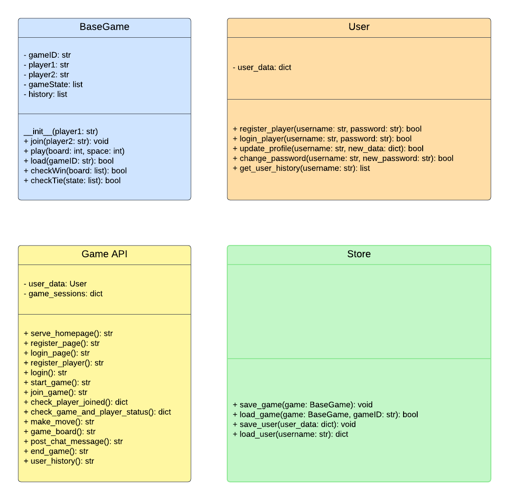

# Any two player Turn-Based Game Framework Documentation

## Introduction

This document presents the architectural design of a modular framework that can be developed to support the creation of Any turn-based two-player games updating an existing game framework, originally designed for Ultimate Tic-Tac-Toe. The objective is to create a modular and extensible framework that simplifies the development process for new games. The following sections will discuss potential modifications to the modular structure, the interfaces and responsibilities of each component, and how game programmers might leverage this updated framework.

## Proposed Modular Structure Updates

### 1. Game Engine Module (`game.py`)

- **Interface**:
  - Introduce an abstract base class `BaseGame` with methods for initializing the game, making moves, and checking game status.
- **Responsibilities**:
  - Managing the turn-based logic and maintaining the state of the game.
  - Providing a template for game-specific implementations through subclasses.
- **Proposed Changes**:
  - Develop a base class `BaseGame` to handle common game functionalities.
  - Implement subclasses (For example: `ChessGame`, `CheckersGame`, etc.) for each game type, defining their specific rules and logic.

### 2. Game Interface Module (`modules/applogic.py`)

- **Interface**:
  - Expose methods for starting a new game, making moves, and getting the current game state.
- **Responsibilities**:
  - Acting as a mediator between the game engine and external interfaces (e.g., web API, GUI).
  - Handling user inputs and translating them into actions in the game engine.
- **Proposed Changes**:
  - Adapt the existing game class to utilize instances of `BaseGame` or its subclasses.
  - Update methods to interact with the abstracted game engine interface.

### 3. Game Storage Module (`modules/store.py`)

- **Interface**:
  - Provide functions for saving and loading game states and user data.
- **Responsibilities**:
  - Persisting game states and user information.
- **Proposed Changes**:
  - Enhance the storage functions to support different game types and their specific data.
  - Implement a mechanism to serialize and deserialize game-specific data.

### 4. Player Management Module (`modules/user.py`)

- **Interface**:
  - Offer methods for player registration, login, profile updates, and managing user history.
- **Responsibilities**:
  - Managing user accounts and authentication.
  - Storing user-specific data such as game history and preferences.
- **Proposed Changes**:
  - Extend the module's functionality to include additional player-related features as needed.

## Utilization by Game Programmers

Game programmers can take advantage of the updated framework in the following ways:

- **Creating a New Game**:
  - Define a new subclass of `BaseGame` for the new game, implementing its specific rules and logic.
- **Interacting with the Game**:
  - Use the Game Interface Module to manage user interactions with the game.
- **Persisting Game States**:
  - Employ the Game Storage Module to implement saving and loading functionalities for game states.
- **Handling Players**:
  - Utilize the Player Management Module for all aspects related to player management.

## Conclusion

The proposed updates aim to transform the existing framework into a more flexible and modular structure, enabling the easy integration of diverse turn-based two-player games. By updating the framework according to this, game programmers can use the framework to make coding any other turn based two player game easier.

