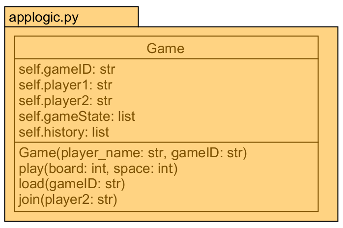

  

# Instance Variables   
self.gameID: string represting the game Id of the game.  

self.player1: string represting the username of player 1.  

self.player2: string represting the username of player 2.  

self.gameState: List contaning 3 items.  
gameState[0] is a number repersenting the current state or turn of the game:  
0 = waiting  
1 = active, player 1's turn  
2 = active, player 2's turn 
3 = ended, player 1 won  
4 = ended, player 2 won  
5 = ended, tie  
gameState[1] containt a List of all the boards represented by lists. Each board contains 9 items representing each space in the board.
gameState[2] contains a List representing the larger board. After a game on a board this list is updated to track that win.  

self.history: List containing all previous gameStates.  

# Methods  
play() - Plays on given space.  
 * Will raise error if input is less than 0 or greater than 8, or if space being played is already played.  
 * Expects that the current player is playing. 
 * Checks if play will result in a win and updates game accordingly.
 * After a play, will update gameState to change turn to other player, or to show the end results.  
 * Will also save previous gameState to history after a play.  
 * Saves to persistant storage after every play.  

load() - loads game from storages based on gameID.  
 * Used to load a game from persistant storage.
 * If no game id is given, it will load based on own gameID.
 * Returns True if game is able to be loaded, else returns false.

join() - joins game waiting for other player. 
 * Used to start a game after it had been created by another player.
 * Added a player 2 to a game and sets it to active
 * Updates the turn to either player 1 or player 2's turn at random
