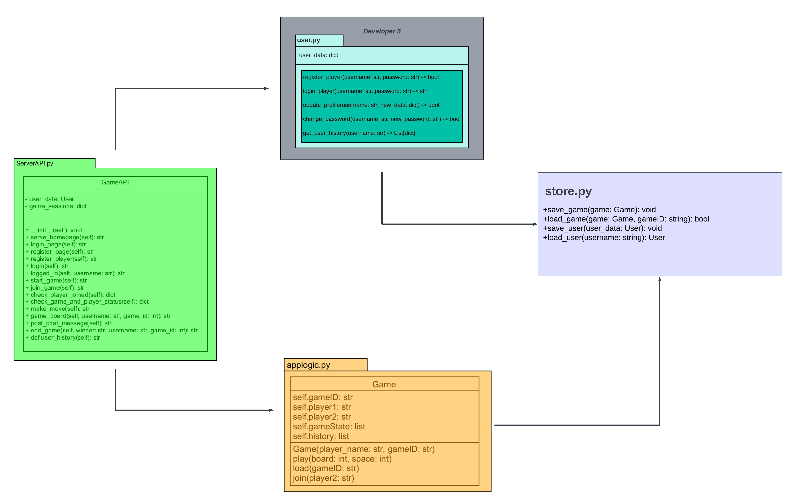

# Multiplayer Tic Tac Toe Game Server

Tic Tac Toe Game Server is a Python-based web server designed to facilitate multiplayer games of "Tic Tac Toe" using bottle framework.

# Tic Tac Toe Game Server Architecture

## Overview
The Tic Tac Toe Game Server is designed to facilitate multiplayer games of Tic Tac Toe over the web. It provides functionalities such as user registration, login, game creation, joining games, making moves, and determining game outcomes.

## Modules
1. **Server API Module**: Handles HTTP requests, serves HTML pages, and routes requests to appropriate endpoints.
2. **User Management Module**: Manages user registration, login, and profile updates.
3. **Game Logic Module**: Implements the core game logic including creating games, making moves, and determining game outcomes.
4. **Data Storage Module**: Handles the persistence of game and user data using JSON files.
5. **HTML Rendering Module**: Renders HTML templates for different web pages.

## File Structure

## Description

### 1. Server API Module
- **Components**: `serverAPI.py`
- **Responsibilities**: Handle HTTP requests, serve HTML pages, and route requests to appropriate endpoints.

### 2. User Management Module
- **Components**: `user.py`
- **Responsibilities**: Manage user registration, login, and profile updates.

### 3. Game Logic Module
- **Components**: `applogic.py`
- **Responsibilities**: Implement game logic including creating games, making moves, and determining game outcomes.

### 4. Data Storage Module
- **Components**: `store.py`
- **Responsibilities**: Handle the persistence of game and user data using JSON files.

### 5. HTML Rendering Module
- **Components**: HTML template files in `html_template/`
- **Responsibilities**: Render HTML templates for different web pages such as homepage, login page, player registration page, game board, and end game.

## Notes
- Each module is self-contained with clearly defined responsibilities.
- The architecture promotes modularity and scalability, making it easier to understand and maintain the codebase.
- Developers can work on different modules independently, enhancing collaboration and productivity.
