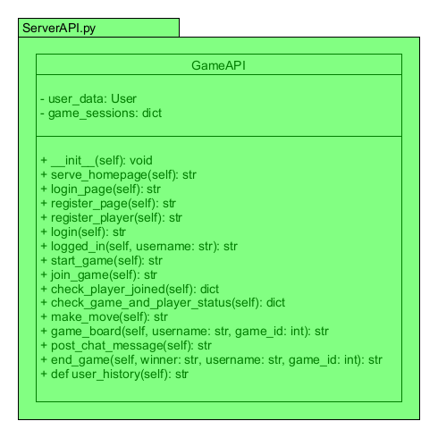

# GameAPI Class Documentation

## Module: ServerAPI.py

The `ServerAPI.py` module contains the `GameAPI` class, serving as the interface for handling requests to the Super Tic Tac Toe game server. This class is responsible for defining HTTP routes and their corresponding handlers, offering a RESTful API for game server interactions.

## Class: GameAPI

### Description

The `GameAPI` class inherits from the `Bottle` web framework and defines the HTTP routes and their corresponding handlers for the Super Tic Tac Toe game server. It provides a comprehensive interface for registering players, logging in, starting and joining games, making moves, posting chat messages, checking game status, and managing user history.

### Initialization

The constructor (`__init__`) method initializes the `GameAPI` class, sets up the game server routes, and initializes user data and game sessions storage.

### Methods

#### serve_homepage()

- **Description**: Serves the homepage of the game server.
- **Returns**: The homepage template.

#### login_page()

- **Description**: Serves the login page for player authentication.
- **Returns**: The login page template.

#### register_page()

- **Description**: Serves the registration page for new players.
- **Returns**: The player registration page template.

#### register_player()

- **Description**: Registers a new player with the game server.
- **Returns**: Redirects to the logged-in page if successful, otherwise returns to the registration page with an error message.

#### login()

- **Description**: Authenticates a player and logs them into the game server.
- **Returns**: Redirects to the logged-in page if successful, otherwise returns to the login page with an error message.

#### logged_in()

- **Description**: Serves the page that allows authenticated users to join or start a game.
- **Parameters**: `username` (optional).
- **Returns**: The logged_in template.

#### start_game()

- **Description**: Starts a new game session.
- **Returns**: A lobby template for the player to wait for an opponent or a notification of an existing game session.

#### join_game()

- **Description**: Allows a player to join an existing game session using a game ID.
- **Returns**: Redirects to the game board if successful, otherwise returns an error message.

#### check_player_joined()

- **Description**: Checks if a player has joined the game.
- **Returns**: A JSON object indicating whether a player has joined.

#### check_game_and_player_status()

- **Description**: Checks the current status of the game and the player.
- **Returns**: A JSON object with update status, current player turn, and win status.

#### make_move()

- **Description**: Records a player's move in the game session.
- **Returns**: Updates the game board or returns an error if the move is invalid.

#### game_board()

- **Description**: Displays the current state of the game board.
- **Parameters**: `username` (optional), `game_id` (optional).
- **Returns**: The game board template or an error message.

#### post_chat_message()

- **Description**: Posts a chat message to the game session.
- **Returns**: Updates the game board with the new chat message or returns an error if the game ID is invalid.

#### end_game()

- **Description**: Ends the game session and displays the game outcome.
- **Parameters**: `winner`, `username`, `game_id`.
- **Returns**: A template rendering the end of the game with the specified winner message.

#### user_history()

- **Description**: Displays the game history for a user.
- **Returns**: A template showing the user's game history.
