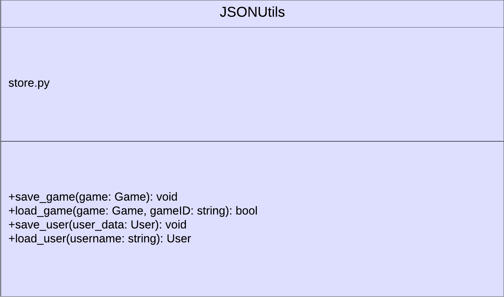

# Store Component Overview

The store component manages data storage and retrieval, ensuring persistence of game states and player information across sessions.

## Component Interface

- **save_game(game_id, game_object)**: Saves a game object.
- **load_game(game_id)**: Loads a game object, returning `None` if not found.
- **save_user(user_data)**: Saves user data to a JSON file.
- **load_user(username)**: Loads user data from a JSON file, returning `None` if not found.

## Key Considerations

- Implementations can vary from in-memory storage to databases.
- Incorporate error handling and security measures for sensitive data.

## Integration

- Interacts with game logic and user management components.

## UML Diagram

