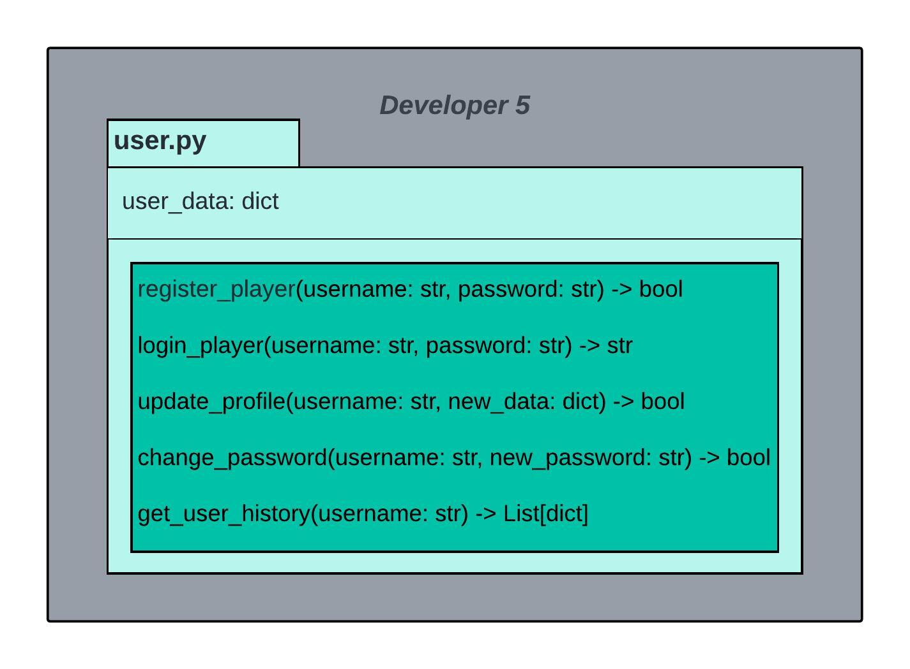

## User Module

The User Module is a critical component of our game server, tasked with managing player-related functionalities to ensure a smooth and engaging gaming experience. This module covers a range of features, including player registration, authentication, profile management, and potential extensions for tracking player performance, challenges, and tournaments.

#### No big change in uml diagram. 

In this UML Diagram:
- `user_data` represents the internal data structure holding user information.
- `register_player` and `login_player` are methods for player registration and login.
- `update_profile` and `change_password` are methods for profile management and password changes.
- `get_user_history` retrieves the user's activity history.

## User Module

The User Module is a critical component of our game server, tasked with managing player-related functionalities to ensure a smooth and engaging gaming experience. This module covers a range of features, including player registration, authentication, profile management, and potential extensions for tracking player performance, challenges, and tournaments.

### Class: User

#### Attributes:
- `user_data`: A dictionary holding user information such as usernames, passwords, and activity history.

#### Methods:

##### `__init__()`
- Description: Initializes the User module.
- Parameters: None.
- Returns: None.

##### `register_player(username: str, password: str) -> bool`
- Description: Registers a new player with the given username and password.
- Parameters:
  - `username` (str): The username of the new player.
  - `password` (str): The password of the new player.
- Returns:
  - bool: True if registration is successful, False otherwise.

##### `login_player(username: str, password: str) -> str`
- Description: Logs in a player with the provided username and password.
- Parameters:
  - `username` (str): The username of the player.
  - `password` (str): The password of the player.
- Returns:
  - str: Session token for authenticated access.

##### `update_profile(username: str, new_data: dict) -> bool`
- Description: Updates the profile of the player.
- Parameters:
  - `username` (str): The username of the player.
  - `new_data` (dict): New data to update in the player's profile.
- Returns:
  - bool: True if profile update is successful, False otherwise.

##### `change_password(username: str, new_password: str) -> bool`
- Description: Changes the password of the player.
- Parameters:
  - `username` (str): The username of the player.
  - `new_password` (str): The new password for the player.
- Returns:
  - bool: True if password change is successful, False otherwise.

##### `get_user_history(username: str) -> List[dict]`
- Description: Retrieves the activity history of the player.
- Parameters:
  - `username` (str): The username of the player.
- Returns:
  - List[dict]: List of dictionaries representing the player's activity history.

### Interface Discussion

#### `register_player(username: str, password: str) -> bool`
The `register_player` method is responsible for facilitating the seamless onboarding of new players into the system. It takes a unique `username` and a secure `password` as parameters, ensuring that players provide essential information for account creation. The method returns a boolean value indicating the success of the registration process. This functionality is crucial during the initial player interaction with the game server.

#### `login_player(username: str, password: str) -> str`
The `login_player` method enables registered players to securely log in. It takes the `username` and `password` as parameters, verifying the provided credentials against the stored information. Upon successful validation, the method generates and returns a session token (`str`) for authenticated access to the game server. This token is a key element for maintaining secure player sessions during gameplay.

#### `update_profile(username: str, new_data: dict) -> bool`
Players can manage their profiles using the `update_profile` method. It takes the `username` and new profile data (`new_data` in the form of a dictionary) as parameters. This method ensures players can modify their account details, facilitating a personalized gaming experience. The method returns a boolean indicating whether the profile update was successful.

#### `change_password(username: str, new_password: str) -> bool`
For enhanced security, players can change their passwords using the `change_password` method. It takes the `username` and a new `password` as parameters, updating the stored credentials. The method returns a boolean to confirm whether the password change process was successful.

#### `get_user_history(username: str) -> List[dict]`
The `get_user_history` method allows players to retrieve their activity history within the system. By providing their `username` as a parameter, players can access a list of dictionaries containing information about their past interactions and gaming activities. This feature adds a layer of engagement by offering insights into a player's gaming journey.

