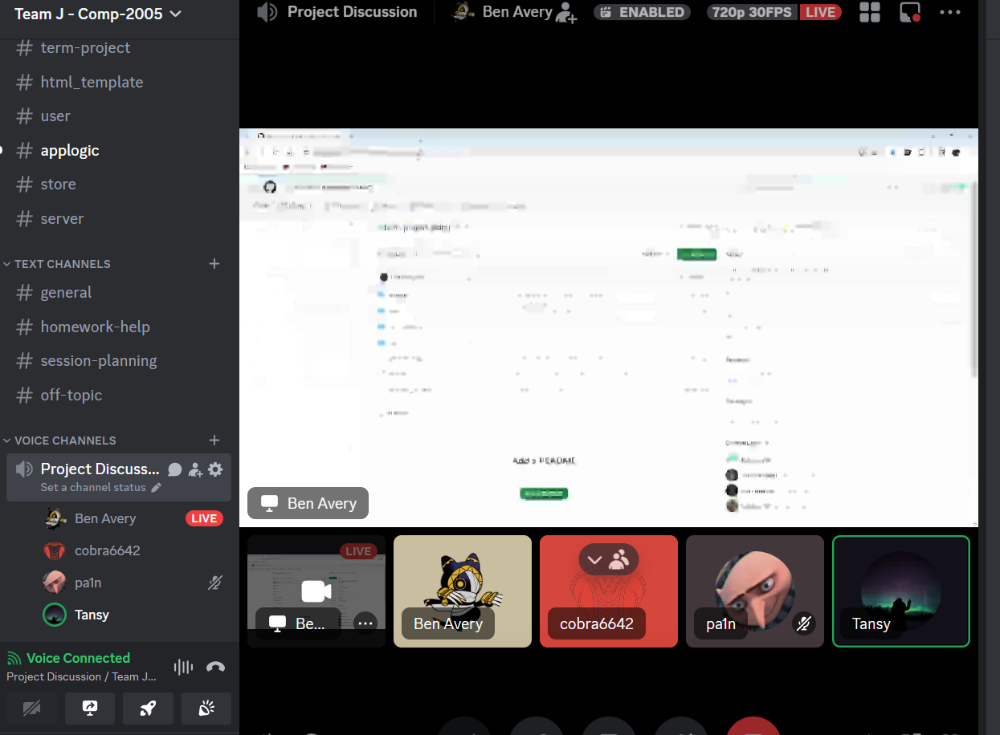

# Meeting Notes

## Feb 07, 2024
**Recorded by:** Muhammed Patel (mrpatel)    
**Notes submiited on:** Feb 7th, 2024  
**Venue:** In class and Discord https://discord.gg/6SDdS29q (Feb 7th, 2024)   
**Attendance**   
**Present:** Muhammed, Luckman, Ben   
**Absent:** Tanaya

Discussed whos gonna do what architectural component

1) **docs/arch_serverAPI.md:** _Luckman_ 
2) **docs/arch_applogic.md:** _Benjamin_
3) **docs/arch_store.md:** _Tanaya_ she was absent in class so we just assigned this task to her.
4) **docs/arch_html.md:** _Whole Team_  as we are team with the 4 members will try to do this part all together
5) **docs/arch_user.md:** _Muhammed_ 

## Feb 12, 2024
**Scrum Master:** Ben Avery (javery)   
**Recorded by:** Luckman Qasim (mlqasim)   
**Notes submitted on:** Feb 12, 2024    
**Venue:** Discord https://discord.gg/6SDdS29q (Feb 12th, 2024)   
**Source:** [Discord Group](https://discord.gg/6SDdS29q)  
**Time:** 10:00 pm - 11:00 pm (Discord)  
**Attendance:** Muhammed, Luckman, Ben, Tanaya  
**Agenda:** Task progress and how to tackle the HTML component.  

Ben has completed the diagram, stubs and docstrings, for the AppLogic and is currently working on the unit tests. Luckman, Muhammad, and Tansy are currently working on their respective components. HTML templated would be done individually by everyone, depending on their component requirements.

## Feb 16, 2024
**Scrum Master:** Luckman Qasim (mlqasim)   
**Recorded by:** Ben Avery (javery)   
**Notes submitted on:** Feb 12, 2024    
**Venue:** In class (Feb 16th, 2024) & discord  
**Source:** [Discord Group](https://discord.gg/6SDdS29q)   
**Time:** 2:00pm - 2:50pm  
**Attendance:** Muhammed, Luckman, Ben, Tanaya(discord)   
**Agenda:** Finalize roles and check on progress  

Ben still has unit tests remaining and will do arch_project.md. Luckman needs to do unit tests and arch file. Muhammed has to finish unit tests. Everyone will be ready to make pull requests by tonight. Tanaya is finishing up her part and should also be ready.

## Feb 17, 2024
**Scrum Master:** Muhammed Patel (mrpatel)   
**Recorded by:** Muhammed Patel (mrpatel)   
**Notes submitted on:** Feb 12, 2024    
**Venue:** In class (Feb 17th, 2024) & discord  
**Source:** [Discord Group](https://discord.gg/6SDdS29q)   
**Time:** 7:00pm - 8:30pm  
**Attendance:** Muhammed, Luckman, Ben, Tanaya(discord)   
**Agenda:** Merge Request meeting, checked everyones work, finalized and Merged everyones branch to master   

## Feb 29, 2024
**Scrum Master:** Benjamin Avery (javery)   
**Recorded by:** Tanaya Siddiqui (tsiddiqui)  
**Notes submitted on:** Mar 4, 2024    
**Venue:** discord https://discord.gg/6SDdS29q (Feb 29, 2024)   
**Discord group link:** [Discord Group](https://discord.gg/6SDdS29q)      
**Time:** 7:00pm - 8:00pm   
**Attendance:** Muhammed, Luckman, Ben, Tanaya      
**Agenda:** Ben set up a Kanban board with an initial list of tasks, open for additions as the project progresses. The team decided to start with implementing the functions that was planned in the first assignment, and later assign the remaining tasks to certain team members.

## Mar 1, 2024
**Scrum Master:** Benjamin Avery (javery)   
**Recorded by:** Muhammed Patel (mrpatel)   
**Notes submitted on:** Mar 1, 2024    
**Venue:** In class (Mar 1, 2024) & discord  
**Discord group link:** [Discord Group](https://discord.gg/6SDdS29q)   
**Time:** 2:00pm - 3:00pm  
**Attendance:** Muhammed (in class), Luckman(discord), Ben (in class), Tanaya(discord)   
**Agenda:** Looked through the feedback for Assignment 1, discussed what we have to do for our future tasks and what needs to be implemented. and assigned time to everyone for sprint1 completion.  

## Mar 4, 2024
**Scrum Master:** Tanaya Siddiqui (tsiddiqui)  
**Recorded by:** Benjamin Avery (javery)  
**Notes submitted on:** Mar 4, 2024    
**Venue:** In class   
**Discord group link:** [Discord Group](https://discord.gg/6SDdS29q)   
**Time:** 2:00pm - 3:00pm  
**Attendance:** Muhammed, Luckman, Ben, Tanaya     
**Agenda:** No progress has been started on tasks, inital implimination of modules is expected to be done or mostly done by friday for code review.  Ben added tasks for HTML function for user and main page as well as posted an issue to clean up files. Tanya will add functions to store user as apart of store module.   

## Mar 8, 2024
**Scrum Master:** Benjamin Avery (javery)  
**Recorded by:** Luckman Qasim (mlqasim)  
**Notes submitted on:** Mar 11, 2024    
**Venue:** Discord   
**Discord group link:** [Discord Group](https://discord.gg/6SDdS29q)   
**Time:** 8:00pm - 9:00pm  
**Attendance:** Muhammed, Luckman, Ben, Tanaya     
**Agenda:** Applogic, User Authentication, and HTML Templates have been done. Server API and Store are still under developed. A few issues were discussed regarding the implementation of the Server API and the Store.

## Mar 11, 2024
**Scrum Master:** Muhammed Patel (mrpatel)  
**Recorded by:** Muhammed Patel (mrpatel)  
**Notes submitted on:** Mar 11, 2024    
**Venue:** Discord   
**Discord group link:** [Discord Group](https://discord.gg/6SDdS29q)   
**Time:** 10:00pm - 11:00pm  
**Attendance:** Muhammed, Luckman, Ben, Tanaya     
**Agenda:** Issues discuused regarding applogic and Server, and html template, discussed about store method and issue tracker and kanban board. planned the style of game page and game logic. Code review done for all modules and all members.     
**Deadline date and time:** Saturday 16th March by 11pm, we won't accept any more pull request for the sprint-1

## Mar 16, 2024
**Scrum Master:** Muhammed Patel (mrpatel)  
**Recorded by:** Benjamin Avery (javery)  
**Notes submitted on:** Mar 16, 2024    
**Venue:** Discord   
**Discord group link:** [Discord Group](https://discord.gg/6SDdS29q)   
**Time:** 8:00pm - 9:00pm  
**Attendance:** Muhammed, Ben,    
**Agenda:** Discussed readME, process model and performance reviews for submittion tonight. Also discussed improvements to process for next sprint. Need to inforce more deadlines, code reviews and more consistant team meetings.  

## Mar 22, 2024
**Scrum Master:** Benjamin Avery (javery)  
**Recorded by:** Muhammed Patel (mrpatel)  
**Notes submitted on:** Mar 22, 2024    
**Venue:** Discord   
**Discord group link:** [Discord Group](https://discord.gg/6SDdS29q)   
**Time:** 2:00pm - 3:00pm  
**Attendance:** Muhammed, Ben,    
**Agenda:** Did Code review, decided deadlines for the final tasks. fixed some bugs in the code and talked with professor about session management. 

## Mar 25, 2024  
**Scrum Master:** Muhammed Patel (mrpatel)  
**Recorded by:** Tanaya Siddiqui (tsiddiqui)  
**Notes submitted on:** Mar 25, 2024  
**Venue:** In class  
**Time:** 2:00pm - 2:50pm  
**Attendance:** Muhammed, Ben, Tanaya  
**Agenda:** Discussed upcoming tasks for the next few days. Reviewed and discussed grades for Feedback 2. Explored strategies for improvements. Addressed and resolved bugs found on the game page and game board. Consulted with the professor regarding grading and feedback implementation.  

## Mar 29, 2024  
**Scrum Master:** Luckman Qasim (mlqasim)  
**Recorded by:** Benjamin Avery (javery)  
**Notes submitted on:** Mar 25, 2024  
**Venue:** In class  
**Time:** 2:00pm - 2:50pm  
**Attendance:** Luckman, Ben, Tanaya  
**Agenda:** Did code review for Tanaya's work. Code was good execpt for a few errors in loading game's and user's that needed to be fixed. After the issues were solved the code was approved by Ben and Luckman and was pushed to master branch. Also discussed implimenting feature to view user history and discussed how it would be implimented. Store functionality needs to be added to user. Both tasks are expected to be done by monday.  

## Apr 01, 2024  
**Scrum Master:** Benjamin Avery (javery)     
**Recorded by:** Luckman Qasim (mlqasim)  
**Notes submitted on:** Apr 01, 2024  
**Venue:** Discord  
**Time:** 10:00pm - 11:50pm  
**Attendance:** Luckman, Ben, Muhammad  
**Agenda:** Did code review for the new templates and the ServerAPI update regarding the user history and a bug. The code was completley correct, and the user history fucntion works as intended. The bug regarding the losing player's screen not updating was fixed. The pull requests for templates and the ServerAPI were merged to the master after review by Luckman, Ben, and Muhammad. Also discussed the additional tasks due by Friday such as user history, etc, and assigned the tasks. 

## Apr 03, 2024  
**Scrum Master:** Tanaya Siddiqui (tsiddiqui)     
**Recorded by:** Muhammed Patel (mrpatel)  
**Notes submitted on:** Apr 03, 2024  
**Venue:** In class  
**Time:** 2:00pm - 3:00pm  
**Attendance:** In class: Ben, Muhammad      
**Discord:** Tanaya, Luckman   
**Agenda:** Task assigned to the team memeber to be completed by friday 5th April, discussed user stories for the additional feature and decided (mlqasim) will work on additional feature. updated kanban board (javery), checked issue Trackers for outstanding issues (mrpatel). (javery) is working on Asynchronous games, (tsiddiqui) is refactoring documents, (mrpatel) updating ReadME, arch_project and other documentations.
**Deadline:** 5th April, 11:30 pm will be our deadline to merge any last pull requests  

## Apr 05, 2024  
**Scrum Master:** Muhammed Patel (mrpatel)     
**Recorded by:** Benjamin Avery (javery)  
**Notes submitted on:** Apr 05, 2024  
**Venue:** In class & discord 
**Time:** 2:00pm - 3:00pm in class, 10pm on discord   
**Attendance:** In class: Ben, Muhammad, Tanya Discord: Ben, Muhammed, Tanya, Luckman         
**Agenda:** In class: We conducted a code review for asycn games (javery), In game chat (mlqasim) and the persitant users (mrpatel). All code was fucntional and was approved by everyone in attendance with no complaints. Luckman explained his code beforehand on discord to be discussed at the meeting. In class we also disscused the remaining tasks for the 11:30 deadline. The tasks to be completed was: Finish user stories (everyone), performance reviews (everyone), update arch documents (everyone), refactoring document (tsiddiqui), update readME (mrpatel), process model (javery).  

In Discord: Merged user stories, completed arch documents, readME and process model to master. refactoring document and the store arch documents are not finished at time of meeting but will be finished and merged to master before 11:30. At 11:30, all files will be organized for final submission (javery). Also discussed issues and features that would have been worked on in a sprint 3. These are to fix a bug letting players play on already played spaces, a logout button and a exit button to the game page.
